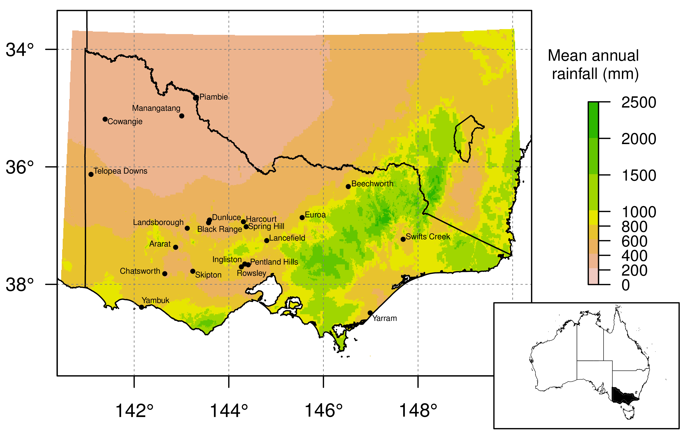

Michael P. Scroggie [^1] -
*Arthur Rylah Institute for Environmental Research, Department of Environment, Land, Water and Planning, PO Box 137, Heidelberg Victoria 3084 Australia. michael.scroggie@delwp.vic.gov.au*

David M. Forsyth -
*Vertebrate Pest Research Unit, NSW Department of Primary Industries, Orange New South Wales 2800, Australia. dave.forsyth@dpi.vic.gov.au*

Steven R. McPhee -
*Agricultural Technical Services Pty Ltd, 48 Warooka Road, Yorketown South Australia 5576 Australia. steven.mcphee@bigpond.com*

John Matthews -
*Agricultural Services and Biosecurity Operations Division, Department of Economic Development, Jobs, Transport and Resources, Mt Napier Road, Hamilton Victoria 3300 Australia. john.matthews@ecodev.vic.gov.au*

Ivor G. Stuart -
*Kingfisher Research Pty Ltd, 177 Progress Road, Eltham Victoria 3095 Australia. ivor.stuart@gmail.com*

Kasey A. Stamation -
*Arthur Rylah Institute for Environmental Research, Department of Environment, Land, Water and Planning, PO Box 137, Heidelberg Victoria 3084 Australia. kasey.stamation@delwp.vic.gov.au*

Michael Lindeman -
*Arthur Rylah Institute for Environmental Research, Department of Environment, Land, Water and Planning, PO Box 137, Heidelberg Victoria 3084 Australia. mikey73@outlook.com*

David S.L. Ramsey -
*Arthur Rylah Institute for Environmental Research, Department of Environment, Land, Water and Planning, PO Box 137, Heidelberg Victoria 3084 Australia. david.ramsey@delwp.vic.gov.au*

[^1]: Corresponding author: Email: michael.scroggie@delwp.vic.gov.au; Phone +61 3 9450 8643; Fax +61 3 9450 8799.
[^2]: Current address: 

\newpage

#Summary

1. Invasive mammalian predators commonly co-exist with invasive mammalian herbivore prey. Managers commonly advocate controlling the invasive prey species in the belief that this would also reduce invasive predator populations. Although such an outcome would have desirable ecological and financial benefits, there have been few tests of this hypothesis. In particular, monitoring of both predator and prey has seldom been undertaken at the appropriate spatial and temporal scales.

2. We used large-scale and long-term monitoring data to test the prediction that invasive red fox *(Vulpes vulpes)* populations decline following control of invasive European rabbit *(Oryctolagus cuniculus)* populations in mainland Australia. Both species severely impact natural and agricultural ecosystems, and significant resources are expended reducing these impacts. We fitted a hierarchical state-space model to spotlight counts of both species conducted at 21 independent transects between 1998 and 2015. The effects of rainfall and density dependence on the population growth rates of both species were simultaneously evaluated.

3. Control activities (i.e. warren ripping and surface harbor removal) were conducted at 18 of the sites and substantially reduced the rate of increase of rabbit populations. Rabbit populations showed little response to rainfall but exhibited strong negative density-dependence and greater rates of increase during autumn-spring.

4. There was no evidence of a numerical response of foxes to changes in rabbit abundance. Rather, fox populations increased with increasing rainfall, and exhibited strongly negative density-dependence. Our model predicted that the mean equilibrium abundance of fox populations will vary with rainfall, but was always < 0.2 foxes per spotlight km.

5. *Synthesis and applications* We conclude that controlling rabbits to low abundances is unlikely to substantially reduce fox abundances in south-eastern Australia. Rather, managers wanting to reduce fox abundances will need to conduct targeted control of this species independent of rabbit control activities. Managers of invasive predator – invasive prey systems should not assume that controlling prey will, by itself, reduce predator abundances. Quantifying the numerical response is critical for understanding the likely response of predators to changing prey abundances.

\newpage

**Keywords:** biological invasions, density dependence, invasive species,  *Oryctolagus cuniculus*, predator-prey dynamics, rate of increase, spotlight counts, state-space model, *Vulpes vulpes*.

**Suggested running title:** *Do invasive prey control invasive predators?*

*Word Counts:* 
Summary: 300; Main Text: 4215; Acknowledgements: 67; References: 1950; Tables: 256 ; Figure Legends: 171.
Number of Tables: 0.
Number of Figures: 4.
Number of References: 67.\todo{Update these numbers}

\newpage


#Introduction

Ivasive mammalian predators commonly co-exist with invasive mammalian herbivore prey [@ruscoe2011unexpected; @bode2015eradicating]. Although eradication of invasive mammalian predators and prey is now technically feasible for smaller islands [@bode2015eradicating], sustained control to low densities is currently the only feasible management option for larger islands and continents [@ruscoe2011unexpected; @glen2013eradicating]. In these systems the costs of simulataneously controlling species in both trophic levels can be prohibitive. The need to rely on sustained control adds to the complexity of the decision-making process, as managers with limited resources may have to continually evaluate the costs and benefits of controlling predators, prey or both in order to achieve desired management outcomes.

There are seldom sufficient resources to simultaneously control multiple invasive taxa, and hence a key question for managers is the extent to which controlling the predator or the prey affects the abundance of the other species [@bergstrom2009indirect; @dowding2009cats; @bode2015eradicating; @morrison2011trophic]. Because of the typically much smaller home-ranges of mammalian prey compared to predators, this question can be addressed by using field experiments in which free-living predators have access to some experimental units containing prey but not others [@pech1992limits].  Field experiments that have excluded mammalian predators sometimes demonstrate significant increases in mammalian prey [@krebs1995impact; @salo2010predator], although the responses in invasive predator-prey systems are often weak or non-existent  [e.g. @pech1992limits; @davey2006exotic; @norbury2015pests]. Bottom-up processes such as food availability, often have stronger positive effects on mammalian prey abundances than the negative effect of mammalian predators [@krebs1995impact;  @prevedello2013population].

In contrast, the abundance of mammalian predators is believed to be primarily determined by food availability ("bottom-up), although there could be a ceiling on this effect due to territorial spacing or other behavioural constraints on abundance at high densities [@macdonald1983ecology; @lindstrom1989food; @cariappa2011reappraisal]. If bottom-up processes truly dominate the growth of invasive predator populations, then this mechanism could be exploited to achieve management control of predator abundance by first controlling prey abundances to low levels, which in turn will limit the ability of predators to increase in numbers, or at least make predator populations more susceptible to other control actions [@norbury2017bottomup; @cruz2013modelling; @courchamp1999control].

Because mammalian predators often operate at large spatial and temporal scales, experiments to test hypotheses about the ecological processes driving their abundances are practically and financially difficult to implement [@krebs1995impact]. Statistical analysis of long-term monitoring data from predator-prey systems provides an alternative approach to testing hypotheses about the outcomes of predator-prey interaction [e.g. @dennis2000joint; @meserve2003thirteen]. In particular, such monitoring data can be used to quantify the numerical response [@sinclair2002complex; @bayliss2002numerical] between predator and prey. A major advantage of this approach is that other potentially important population processes such as density-dependence [@brook2006strength] and variables such as rainfall [@dennis2000joint; @meserve2003thirteen; @letnic2004responses] can be included.

In this study, we use large-scale and long-term monitoring data to evaluate the hypothesis that controlling a widespread invasive mammalian herbivore reduces the abundance of a widespread mammalian predator. The European rabbit *(Oryctolagus cuniculus)*  and red fox *(Vulpes vulpes)* were introduced to Australia in the 19th century, and are now sympatric over c. 69 % of mainland Australia [@west2011australian]. Both species are serious threats to agricultural production and native biodiversity [@mcleod2004counting; @cooke2012rabbits; @saunders2010impacts]. Substantial effort is expended on the control of both species using conventional methods such as warren ripping (for rabbits) and poison baiting (for both species) [@reddiex2007control]. Two biological control agents (myxoma virus and rabbit haemorrhagic disease virus [hereafter RHDV]) have also been established to control rabbits [@fenner1999biological; @mutze2008geographic; @mutze2010effect].  Because rabbits are a major component of fox diet in south-eastern Australia [@davis_foxdiet] there is much interest in understanding the interactions between these species [@Pech_alternativeprey; @norbury2015pests], and in exploiting these interactions to maximise the effectiveness of management for achieving agricultural production and native biodiversity outcomes [@pedler2016rabbit].

Of particular management interest is the effect of controlling rabbits to low densities (either through conventional or biological control) on fox populations [@pech1992limits; @holden2003impact]. If controlling rabbits to low densities results in substantial reductions in fox abundance, then there may be reduced need for targeted fox control. Conversely, if sustained control of rabbits to low abundance does not limit fox populations (perhaps because alternative prey are exploited when rabbits are scarce), then there may be a need to undertake simultaneous, integrated control of both rabbit and fox populations to protect biodiversity and agricultural production values. We predicted that the effect of rabbit abundance on the rate of increase of foxes would either be positive (as greater rabbit abundance would result in improved prey availability for foxes), or close to zero, if the availability of alternative prey sources meant that food did not become limiting when rabbit populations declined.

Rainfall is an important driver of soil moisture, and hence pasture growth on grazing lands in south-eastern Australia [@sanford2003sgs; @RPGOT]. Periods of low rainfall may hence limit food availability for both mammalian herbivores and their predators [e.g. @letnic2004responses; @letnic2011resources; @bayliss1985population]. We predicted that rabbit and fox population growth rates would both respond positively to rainfall, lagged over an appropriate antecedent period [@Pech_alternativeprey]. Finally, current population density may also partly determine the future growth rates of rabbit [@fordham2012european] and fox [@lindstrom1989food; @saunders2010impacts] populations through density-dependent mechanisms. Hence, we also predicted that both rabbit and fox populations would exhibit negative density dependence [*sensu* @brook2006strength].

Computational advances mean that hypotheses concerning complex population dynamics can be evaluated from noisy, complex datasets by fitting hierarchical models to time series of abundance [e.g. @bjornstad2001noisy; @buckland2004state; @new2012modelling]. Here, we use a long-term (1998--2016) and spatially extensive monitoring dataset collected from 21 transects in south-eastern Australia occupied by both European rabbits and red foxes to test these hypotheses about the relationships between predator and prey abundances, together with the effects of rainfall and density dependence on population growth rates.

#Materials and methods

##Transect locations and management histories

Twenty-one monitoring transects distributed throughout the state of Victoria were included in this study (Fig. 1). All transects were located on freehold livestock and cropping properties, with a single transect located on each property. Eighteen of these transects were established in 1998--1999 to evaluate the impact of RHDV and conventional control on rabbit populations [@mcphee2010long]. Three additional transects were added to the study in 2001, 2007 and 2008. The transects were permanently marked, and varied in length from 7.0 - 21.7 km (Table S1). Since the minimum distance between transects (5.4 km) exceeds the home range sizes of both rabbits and foxes in south-eastern Australia [@williams1995managing; @saunders1995managing; @carter2012ecology], the transects were treated as demographically independent. The 21 transects encompassed a climatic and productivity gradient from cool, moist, highly productive sites in the south to hot, dry, low-productivity sites in the north-west (Table S1).

The rabbit management histories of the transects varied. Following the establishment of RHDV in Victoria in 1996, the Victorian government subsidised rabbit management at 14 of the properties from 1996 - 2002 [@mcphee2010long].  Management involved using heavy machinery to remove surface harbour and destroy warrens [for further details see @mcphee2010long]. Three of the originally established properties were deliberately not subjected to this management [@mcphee2010long], although rabbit management was later conducted at one of these properties (Ingliston) from 2010 [@forsyth_density-dependent_2015]. The removal of surface harbour and ripping of warrens resulted in sustained reductions in rabbit abundance over and above the effects of RHDV [@mcphee2010long; @ramsey2014recolonisation].

Foxes were not actively managed on any of the 21 properties, except for occasional recreational shooting. Such shooting has little impact on fox populations [@saunders2010impacts; @saunders1995managing].

Monthly rainfalls were compiled for all transects using records from nearby official weather stations obtained from the Australian Bureau of Meteorology. Where a monthly total for the nearest available weather station was unavailable, data from the next closest station was substituted to obtain a complete monthly rainfall record.

##Spotlight counts

Spotlight counts were conducted between two and four times annually, with the majority of counts made during the austral autumn (March-May) and spring (September-November). Two replicate counts were usually made on each survey occasion, typically on consecutive nights. Counts commenced shortly after sunset, and involved a single observer standing in the tray of a slow-moving (10--20 km h^-1^, depending upon terrain) utility vehicle, searching 100 m either side of the transect line with a hand-held 100 W spotlight [@williams1995managing]. The numbers of rabbits and foxes observed along the transects were recorded. 

Spotlight counts are uncorrected indices of abundance. Although there is debate about the usefulness of such uncorrected population indices [e.g. @hayward2014will; @nimmo2015forum], spotlight counts have long been used to monitor rabbits and foxes in Australia [e.g. @pech1992limits; @saunders1995managing; @williams1995managing; @mutze2010effect], and Europe [e.g. @sobrino2009carnivore and references therein] and it was infeasible to use other methods in our monitoring program. For rabbits, spotlight counts are highly correlated with absolute abundance estimates [@marchandeau2006abundance; @barrio2010assessment], including at one of our monitoring transects [@ballinger2003validating]. Spotlight counts of red foxes have not been similarly evaluated, perhaps due to the difficulty of estimating absolute fox abundances at appropriate spatial scales [@coman1991home].  

##Statistical model

To account for uneven timing and survey effort amongst transects, the spotlight counts of rabbits and foxes were temporally discretized into half-yearly intervals, depending on whether they were made in the first (January--June) or second (July--December) half of each calendar year. Hence, changes in populations were attributed by the model to either the June--July or December--January periods: for the purpose of the model, these seasonal periods of change are referred to as 'winter' or 'summer'.

###Process model

We modelled the time-series of semi-annual observations of rabbit and fox abundance from the 21 transects using an hierarchical, Bayesian, state-space model [@buckland2004state]. The model included the effects of rainfall and density dependence on both species, as well as the effects of rabbit abundance on the rate of increase of fox populations [the numerical response, @bayliss2002numerical].

The prevailing transect-level abundances $(\rho_{jt})$ of rabbits at each transect over the course of the study were modelled as a stochastic, density-dependent process:

$$
\rho_{jt}=\rho_{jt-1} e^{r_{jt}^{rabbit}}
$$

Where $\rho_{jt}$ is the expected mean spotlight count of rabbits at the $j^{th}$ transect at time $t$, and $r_{jt}^{rabbit}$ is the  rate-of-increase for the $j^{th}$ rabbit population during the interval $[t-1,t]$. We decomposed $r_{jt}^{rabbit}$ into components attributable to transect and time-level covariates using a linear model. The model accounted for density-dependence [a Gompertz model; @cruz2013modelling], rainfall (lagged, see below), season (summer or winter), and random transect effects and process errors:

$$
\begin{aligned}
r_{jt}^{rabbit} &=\bar{r}_{rabbit}  + \beta_{5}\log{\rho_{t-1}} + \beta_{6}\mbox{rain}_{jt} +\beta_{7}\mbox{winter}_{t}+\beta_{8}\mbox{ripped}_{jt} +\zeta_{j}^{rabbit} +\epsilon_{t}^{rabbit}
\end{aligned}
$$

where $\bar{r}_{rabbit}$ is the mean rate of increase, and $\beta_{5}-\beta_{8}$ are regression parameters describing the, the strength of density dependence in the rate-of-increase of the rabbit population, the relationship between rate of increase and the lagged rainfall and whether or not the count was made in the second half of the calendar year (denoted as `winter' as such observations reflect population growth over the austral winter). $\zeta_{i}^{rabbit}$ are random transect-level effects with standard deviation $\sigma_{site}^{rabbit}$ on the rate of increase of the rabbit population and $\epsilon_{t}^{rabbit}$ are normally-distributed process errors with standard deviation $\sigma_{process}^{rabbit}$.

The abundances of foxes ($\mu_{jt}$) were modelled simultaneously with those of rabbits, using a model similar to that used for rabbits, but including a term for the numerical response of fox populations to rabbit abundance:

$$
\begin{aligned}
\mu_{t} &=\mu_{t-1} e^{r_{jt}^{fox}} 
\end{aligned}
$$

$$
r_{jt}^{fox}=\bar{r}_{fox} + \beta_{1}\log{rab_{jt}} + \beta_{2}\log{\mu_{t-1}}+\beta_{3}\mbox{rain}_{jt}+\beta_{4}\mbox{winter}_{t}+ \zeta_{j}^{fox}+\epsilon_{t}^{fox}
$$

where $\beta_1 - \beta_4$ are regression parameters, $\bar{r}_{fox}$ is the mean rate of increase, ($rab_{jt}$) are the lagged (see below) abundances of rabbits and $\mu_{t-1}$ is the estimated fox abundance at the previous time step. The other model terms (rain, winter) are equivalent to the comparable terms in the model of rabbit abundance. 

For both rabbits and foxes, we estimated the appropriate lagging period for the effects of rainfall on rates of increase, and for the numerical response of foxes to the abundance of rabbits. Lagged rainfall was defined as:

$$
\mbox{rain}_{jt}=\sum_{m=0}^{m=k}  \frac{r_{jtm}}{k}
$$

where $r_{jtm}$ are the series of rainfall totals at each transect in the months $(m)$ preceding each survey, and $k$ is the maximum lag period considered. Increasing values of $k$ imply averaging of antecedent rainfall over an increasingly long period prior to the survey. The maximum lag parameters $k$ were estimated separately for rabbits and foxes. Lagging periods between 1 and 30 months were considered in the model-fitting process.

Lagged rabbit abundance was defined as:

$$
\mbox{rab}_{jt}=\sum_{m=0}^{m=k} \frac{\rho_{jtm}}{k}
$$

where $\rho$ are the estimated rabbit abundances at each transect at the preceding $k$ half-yearly surveys. Lagging periods between 0 and 4 half-yearly intervals were considered (i.e. up to 2 calendar years).

###Observation model

An overdispersed, zero-inflated Poisson (ZIP) observation model was assumed for the counts of both foxes and rabbits. The the number of individuals observed during each survey was dependent on the underlying abundance, with overdispersed, zero-inflated Poisson errors in the observations. 

Transect lengths were included as offset terms in the observation model to allow for both within- and between-transect variation in the lengths of the spotlight transects (transects varied in length, and some surveys did not cover the full transect length on every occasion, Table S1). For foxes, the observation model was:

$$
C_{ijt}^{fox} \sim \mbox{ZIP}(\lambda^{fox}_{ijt}, \mbox{zinf}^{fox})
$$
$$
log(\lambda^{fox}_{ijt}) = log(\mu_{jt}) + log(L_{ijt}) + \eta^{fox}_{ijt}
$$

where $\lambda^{fox}_{ijt}$ is the expected number of foxes observed during the $i^{th}$ replicate spotlight count, at transect $j$, at time $t$, The corresponding length (in km) of transect surveyed was $L_{ijt}$, and $\eta^{fox}_{ijt}$ are normally distributed error terms, with standard deviation $\sigma^{fox}_{survey}$. The number of foxes counted on each survey was modelled as a zero-inflated Poisson, with expectation $\lambda^{fox}_{ijt}$, and zero-inflation probability $\mbox{zinf}^{fox}$. 

A similar zero-inflated, and overdispersed Poisson observation model was assumed for counts of rabbits on the transects:

$$
C_{ijt}^{rabbit} \sim \mbox{ZIP}(\lambda^{rabbit}_{ijt}, \mbox{zinf}^{rabbit})
$$

$$
log(\lambda^{rabbit}_{ijt}) = log(\mu_{jt}) + log(L_{ijt}) + \eta^{rabbit}_{ijt}
$$

where $\lambda^{rabbit}_{ijt}$ is the expected number of rabbits observed during the $i^{th}$ replicate spotlight count, at transect $j$, at time $t$, The corresponding length (in km) of transect surveyed was $L_{ijt}$, and $\eta^{fox}_{ijt}$ are normally distributed error terms, with standard deviation $\sigma^{rabbit}_{survey}$. The number of rabbits counted on each survey was modelled as a zero-inflated Poisson, with expectation $\lambda^{rabbit}_{ijt}$, and zero-inflation probability $\mbox{zinf}^{rabbit}$. 

```{r message=FALSE, results='hide', echo=FALSE, cache=FALSE}
#load results so we can use inline r to insert resulting numbers
load("Fitted_rain_model.Rdata")

```

### Priors

Weakly informative $\mbox{half-}t_{4}$ priors [@gelman2006prior] were specified for the standard deviations of the process and sampling errors, and for transect-level random effects. Weakly informative $\mbox{Cauchy}(0, 2.5)$ priors [@gelman2008weakly] were specified for the regression parameters relating the rates of increase of foxes and rabbits to the covariates ($\beta$). The lag periods $(k)$ on the demographic responses of rabbits and foxes to rainfall were assigned categorical priors, with equal (uniform) prior weights given to lag periods between 1 and 30 months. Similarly, the lagging period on the demographic response of foxes to rabbit abundance was given a categorical  prior with a maximum lag period of 4 half-years (2 calendar years). 

### Model fitting and checking

The state-space model was fitted to the data using the Bayesian Markov chain Monte Carlo (MCMC) software \textsc{JAGS} [@plummerJAGSmanual]. The \textsc{JAGS} code for the model is provided in Appendix S1. A burn-in of $`r round(NBURN)`$ iterations was undertaken, followed by sampling from four independent Markov chains with different starting values for $`r NITER-NBURN`$ further iterations, retaining every $`r paste0(toOrdinal::toOrdinal(THIN))`$ value. After thinning, a total of $`r (NITER-NBURN)/THIN`$ samples from each of the four chains were retained for inference. The convergence of the MCMC algorithm was assessed using the scale-reduction diagnostic of @brooks1998general, and by visual inspection of parameter trace plots. 

The fit of the state-space model of fox and rabbit abundances was assessed using posterior predictive checks [@gelman1996posterior; @gelman2000diagnostic] and Bayesian p-values. Separate discrepancy estimates, and Bayesian p-values were calculated for rabbits and foxes, to assess the fit of both components of the model.  During model fitting, at each MCMC update simulated rabbit and fox counts were generated, based on the current estimates of the model's parameters. The $\chi^2$ discrepancies between the simulated data and the expected values $(\chi_{rep}^2)$, and between the actual observed counts and the expected values $(\chi_{obs}^2)$ were calculated at each MCMC step, and plotted against each other (Fig. S3). Bayesian p-values were calculated based on the proportion of cases where $\chi_{rep}^2 > \chi_{obs}^2$. To test the adequacy of the model with respect to zero-inflation, the proportion of zero counts of rabbits and foxes in the data was compared to the distribution of simulated numbers of zeros (Fig. S3). 

#Results

##Data scope

A total of `r nrow(spotlight)` spotlight counts were conducted across the 21 transects between mid-1998 and mid-2015 (Table S1). There was a steep gradient in mean annual rainfall between the transects, but also wide seasonal and annual variability within transects (Figs. 1 and S1).  Numbers of rabbits observed during spotlight counts varied from rabbits from `r round(min(spotlight$Rabbits/(spotlight$TransectLength/1000)), 1)` to `r round(max(spotlight$Rabbits/(spotlight$TransectLength/1000)), 1)` per spotlight km and foxes from `r round(min(spotlight$Foxes/(spotlight$TransectLength/1000)), 1)` to `r round(max(spotlight$Foxes/(spotlight$TransectLength/1000)), 1)` per spotlight km respectively.

##Model assessment

Convergence of the model's parameters was judged to be adequate, based on the scale reduction diagnostics of all parameters ($\hat{R}\leq$ `r round(max(samp$Rhat$beta, samp$Rhat$sigma, samp$Rhat$fox.lag, samp$Rhat$rabbit.lag, samp$Rhat$food.lag ), digits=2)`), and on visual inspection of the parameter trace plots. 

The Bayesian p-values, computed from the $\chi^2$ discrepancies (Fig. S3) were 0.7298 and 0.5542 for foxes and rabbits respectively, indicating no significant departure from expectations in the fit of the model to the data. The observed numbers of zero counts for foxes and rabbits were within the range of values expected under the respective posterior predictive distributions. Collectively, these results are indicate adequate fit of the model to the data.

##Rabbit population dynamics

Rates of increase of rabbit populations showed strong negative density-dependence ($\beta_{5}<0$, Fig. 2, Table S2). Rabbit populations increased more rapidly during the autumn-spring (winter) interval than the spring-autumn (summer) interval ($\beta_{7}>0$, Fig. 2, Table S2). Evidence for a direct effect of rainfall on the rate of increase of rabbit populations was weak, with slightly stronger evidence for a negative effect of rainfall, and the best-supported lag period being approximately six monts (Fig. 2, Table S2). The intensive rabbit control activities conducted at 18 of the 21 transects resulted in a consistent reduction in the rate of increase of the rabbit populations ($\beta_{8}<0$, Fig. 2, Table S2). 

##Fox population dynamics

Fox populations also exhibited strong negative density-dependence ($\beta_{2}<0$, Fig. 2, Table S2). Higher rainfalls were followed by higher rates of increase ($\beta_{3}>0$), with the best-supported lag-period for the effect of rainfall being 21 months (Fig. 2, Table S2). There was no evidence of a numerical response of fox populations to rabbit abundance, with the credible interval for this parameter ($\beta_{1}$) easily including zero (Fig. 2, Table S2). 

##Predictive model of fox population dynamics

We used the fitted state-space model to predict the expected half-yearly rates of increase of fox populations under a range of plausible fox and rabbit abundances, under high (50 mm), medium (25 mm) and low (10 mm) monthly rainfalls, and for summer and winter seasons (Fig. 3). These predictions illustrate the dominating effects of rainfall and density dependence in determining the rates of increase of fox populations, with only a very weak numerical response to rabbit abundance, and relatively minor influences of season. We also estimated the conditions under which fox populations would be at equilibrium for each combination of rainfall and season (i.e. $r = 0$; Fig. 2). Regardless of prevailing conditions (season, or rainfall), or the abundance of rabbits, equilibrium abundances were always < 0.2 foxes per spotlight km (Fig. 2). These inferences do not include transect-level random effects, and hence should be interpreted as the approximate equilibrium density at an "average" transect in south-eastern Australia. 

The state-space model was also used to infer the likely abundances of foxes and rabbits over the duration of the observations at all 21 transects, and the uncertainty in those estimates (Fig. 4). The predictions revealed wide variation in rabbit and fox abundances, with periods of increase, decline and fluctuation during the 17 years of monitoring. The predictions of the model were mostly in very close concordance with the observed counts, with relatively small uncertainties in the predicted abundances (expressed as 95 % credible intervals). The uncertainties were greatest when monitoring was temporarily or permanently discontinued at some transects: during these periods the predictions of abundance were driven by the expected dynamics of the population model rather than from direct observations of abundance.

#Discussion

There are few long-term studies of the population dynamics of invasive predator-prey systems, and our data are notable because they are spatially and temporally extensive (21 transects throughout the State of Victoria, and conducted twice-annually over 17 years). Our study included a period of severe and prolonged drought [the Millenium Drought 2001--2009, @dijk2013millennium], and a subsequent high-rainfall period. Furthermore, intensive rabbit control activities were undertaken at most of the transects, significantly reducing rabbit populations. Hence, widely varying rabbit and fox abundances were observed within an dbetween the 21 transects. Our state-space model revealed that the abundances of both predators and prey responded to rainfall (albeit in different ways), density dependence and seasonal effects. Relative to these effects, the fox populations showed no evidence of numerical response to changing rabbit abundances. Hence, the prediction that reductions in the abundance of invasive European rabbits (whether caused by disease, control activities or otherwise) will reduce the abundance of invasive red foxes was not supported.

Our study began after the initial impacts of RHDV on rabbit abundances had run their course [@mutze2010effect; @mcphee2010long]. Most of the transects had been subjected to intensive rabbit control (warren ripping and removal of surface harbour) during 1998--2002, which further reduced rabbit abundances [@mcphee2010long; @ramsey2014recolonisation]. Our analysis confirms the long-term effectiveness of this intensive rabbit control program, which resulted in a lower rate of increase in rabbit populations subsequent to the completion of the control operations (Figs. 2 and 4). 

It is therefore possible that the absence of a numerical response of foxes to rabbits in our study system was partly due to our monitoring period coinciding with a period when rabbit abundances were at historically low levels. If our study had been conducted when rabbit abundances were markedly higher (such as prior to the arrival of RHDV), fox populations may perhaps have been able to increase to higher abundances than were observed during our study period, and a positive numerical response to rabbit abundance may then have been detectable in the data. 

Although rabbits are a major prey source for fox populations in south-eastern Australia, the availability of alternative food sources means that foxes can respond to reduced rabbit abundance by switching to alternative food sources, such that there is a little demographic impact on fox populations when rabbit populations change, at least to the extent observed in the current study. Several previous studies of invasive fox populations in Australia, and in the native European range have demonstrated strong functional responses of foxes to changes in rabbit abundance, with foxes consuming less rabbits, in both absolute and proportional terms when rabbit abundance are low [@catling1988similarities; @davey2006exotic; @delibes2008feeding; @Ferreras2011116]. However, the existence of a strong functional response to prey abundance does not automatically lead to an equally strong numerical response that will result in causative changes in the abundance of predators. 

In the native range, @sobrino2009carnivore reported no change in abundance of foxes in a population that had recently experienced RHDV-induced collapse in rabbit abundance, and @Ferreras2011116 reported a slight negative trend\todo{check Ferreras for stats and reword from slight to something more definite} in fox abundance, subsequent to the decline in rabbit abundance. In their invasive range, @edwards2002population reported no decline in foxes, subsequent to an RHDV-induced collapse in rabbit populations in arid Central Australia. Similarly, @davey2006exotic found no evidence of reduced abundance of red foxes in a temperate area of New South Wales. In contrast, @holden2003impact found that fox abundances declined significantly in the South Australian arid zone following the arrival of RHDV. Collectively, these results provide good evidence of a function response of red foxes to rabbit abundance, but that there is often not an associated numerical response of foxes to declining rabbit abundance. 

##Rainfall and rabbit-fox population dynamics

Rainfall is thought to be a major driver of the abundances of mammalian herbivores and predators in semi-arid and arid systems worldwide [@dennis2000joint; @letnic2004responses; @shaw2012population]. Our 21 monitoring transects spanned a gradient from semi-arid to temperate climates. Contrary to expectations [@Pech_alternativeprey], antecedent rainfall had a negative effect on the rates of increase of rabbit populations after other sources of variation in the model were accounted for. Our analysis provides little direct basis for determining the mechanism behind this result, but several hypotheses seem plausible. First, during the course of the study rabbits at all transects were subject to other sources of mortality, including infection with RHDV and myxomavirus. Outbreaks of disease could have limited the potential for rabbit populations to increase rapidly under otherwise suitable high rainfall conditions, especially as periods of heightened mortality due to RHDV are known to coincide with rabbits' peak breeding season [i.e., late winter and spring @mutze2008geographic; @wells2015timing]. Second, most transects were subject rabbit control activities during our study. The combined impacts of disease, climatic extremes and rabbit control may have constrained the ability of the rabbit populations to increase rapidly during periods of high rainfall. Third, periods of especially high rainfall have been associated with mortality of rabbits attributable to flooding or collapse of warrens [@bowen1998population; @robson1993natural; @palomares2003negative], providing a measure of negative feedback in the relationship between rainfall and rabbit abundance. This latter mechanism would be most likely to operate in temperate environments with high rainfall, and may depend on soil type.

In contrast to rabbits, antecedent rainfall had a markedly positive effect on rates of increase of fox populations. The effect of rainfall on fox populations was strongly lagged, with a lag-period of 21 months being best supported by the data. Foxes are omnivores, eating a wide range of mammal, reptile, bird, insect and plant material [for south-eastern Australia, see @davis_foxdiet], and readily switch between food sources as availability changes [@delibes2008feeding; @holden2003impact; @davey2006exotic; @Kjellander_preyswit; @Leckie_preyswitch]. It is plausible that periods of high rainfall may have increased the availability of many of these foods (with the exception of rabbits, see above), and that this in turn increased survival and recruitment. There are, however no data on the availability of alternative foods in our study system are lacking with which to test this hypothesis.

##Density-dependence in fox and rabbit populations

Analyses of time series of abundance have revealed that density dependence is widespread in mammalian populations [@sibly2005regulation; @brook2006strength], but to our knowledge this is the first study to directly demonstrate negative density-dependent effects of rates of increase of either rabbit or fox populations in Australia. Density-dependent reproduction has been reported in the native range of rabbits [@rodel2004density], and in South Australia adult rabbit density negatively affected kitten and adult rabbit survival rates [@fordham2012european]. There is also evidence that RHDV has a negative density-dependent effect on rabbit populations in south-eastern Australia [@mutze2010effect]. Density-dependence has also been demonstrated in the native range of the red fox [e.g. @forchhammer2000invading] and is thought to arise from suppression of reproduction in sub-dominant vixens via territoriality [@lindstrom1989food; @saunders1995managing]. Other mechanisms such as competition for food and lower survival of young at high densities are also plausible.

##Seasonal changes in rabbit and fox abundances

The seasonal changes we observed in rabbit and fox rates of increase are consistent with their reproductive biology in south-eastern Australia. The peak of rabbit breeding in south-eastern Australia occurs during late winter and spring, with low survival of kittens born in summer and autumn. Hence, increases in rabbit populations are most likely to be observed over the winter-spring months [@williams1995managing; @bowen1998population; @fordham2012european; @wells2016environmental]. Conversely, foxes breed during the austral spring, with cubs emerging from their dens in late spring and early summer and being weaned soon after [@coman1991home; @saunders1995managing]. Accordingly, increases in fox abundance due to favourable conditions for reproduction should be most readily observable from differences in consecutive surveys that span the summer months. 

##Management implications

Controlling prey populations to control invasive predators has long been advocated by applied ecologists [e.g. @norbury2017bottomup; @courchamp1999control], but there have been few robust tests of this idea. We found no support for the hypothesis that red fox populations exhibit a positive numerical response to rabbit abundances [@Pech_alternativeprey; @norbury2015pests]. An important implication of this result is that rabbit control [whether conventional or biological; @cooke2003rabbit; @mutze2010effect; @ramsey2014recolonisation] should not be viewed as a surrogate for fox control. Rather, managers who wish to maintain foxes at low densities to protect agricultural [e.g. @saunders2003observations] or biodiversity [e.g. @robley2014long; @pedler2016rabbit] values should implement fox control independently of rabbit control. As foxes may increase their consumption of alternative prey following large reductions in rabbit density [@holden2003impact; @delibes2008feeding; @Ferreras2011116], a risk-averse approach for managers wishing to limit unintentional impacts on threatened prey would be to increase fox control following large reductions in rabbit abundance. Whether a proactive or reactive approach to fox control should be adopted would depend on the relationships between the costs and the effectiveness of control, and the expected response of the protected assets (threatened species or livestock) to reductions in fox abundance. Our finding that fox abundances increased more rapidly in response to high rainfall means that managers wishing to maintain foxes at low abundances in south-eastern Australia should be cognisant of prevailing climatic conditions and adjust control activities accordingly. Initiating or intensifying fox control operations in response to periods of high rainfall could be an appropriate strategy.

The results of our study should encourage managers of invasive predator-prey systems to critically examine management strategies that are underpinned by an assumption of bottom-up regulation of predator populations. Devising management strategies assuming that bottom-up processes will reduce predator abundances could lead to less effective population control, and sub-optimal allocation of resources to alternative management actions. Critical evaluation of mechanisms regulating invasive predator populations using either experimental or observational approaches should be undertaken wherever possible. 


#Authors' contributions
MPS, DMF and DSLR conceived the ideas and designed the methodology; JM, MPS, DMF, SRM, IGS, KAS, ML and DSLR collected the data; MPS analysed the data; MS and DMF led the writing of the manuscript. All authors contributed critically to the drafts and gave final approval for publication.

#Acknowledgements

We thank the landholders who provided access to the monitoring transects located on their properties, and all of the staff (too numerous to list here) who conducted the spotlight counts. The Victorian Department of Economic Development, Jobs, Transport and Resources funded this work. Helpful comments on drafts of the manuscript were provided by  Andrew Bennett, Canran Liu, Deirdre Lucas, Lindy Lumsden, Michael Bode and two anonymous reviewers.

#Data Accessibility
All data, and *JAGS* and *R* code necessary to implement the state-space model and reproduce the numerical results presented in this paper are available at [https://github.com/scrogster/Fox_Model](https://github.com/scrogster/Fox_Model). Upon acceptance, a snapshot of the code and data will be deposited in the Zenodo digital archive.

\newpage
#References

<div id = "refs"></div>

\newpage




![Predicted (line) and observed (points) relative abundances (spotlight counts per transect km) of foxes (lower orange line/ open triangles) and rabbits (upper blue line / closed circles) at each of the 21 transects during the study. Transects are arranged in order of increasing rainfall. Solid lines are posterior medians, and shaded polygons are the 95% credible intervals of expected abundances. Vertical dashed lines denote the time of completion of major rabbit control operations at 18 of the transects. The shaded region of the graph denotes the approximate limits of the historically severe Millenium Drought in south-eastern Australia (2001-2009). Note that y-axes are of logarithmic scale.](Figures/fox_abund.png)


\newpage
#Supporting Information
Additional Supporting Information to be included in the online version of the article:

**Table S1.** Summary statistics for the 21 transects surveyed for abundance of foxes and rabbits.

**Table S2.** Summary statistics for the posteriors distributions of the parameters of the state-space model of rabbit and fox abundances.

**Appendix S1.** JAGS code for the Bayesian state-space model.

**Figure S1.** Monthly rainfalls at the 21 monitoring transects.

**Figure S2.** Posterior densities for the transect-level random effects terms for rates of increase of rabbits and foxes.

**Figure S3.** Posterior predictive checks.


